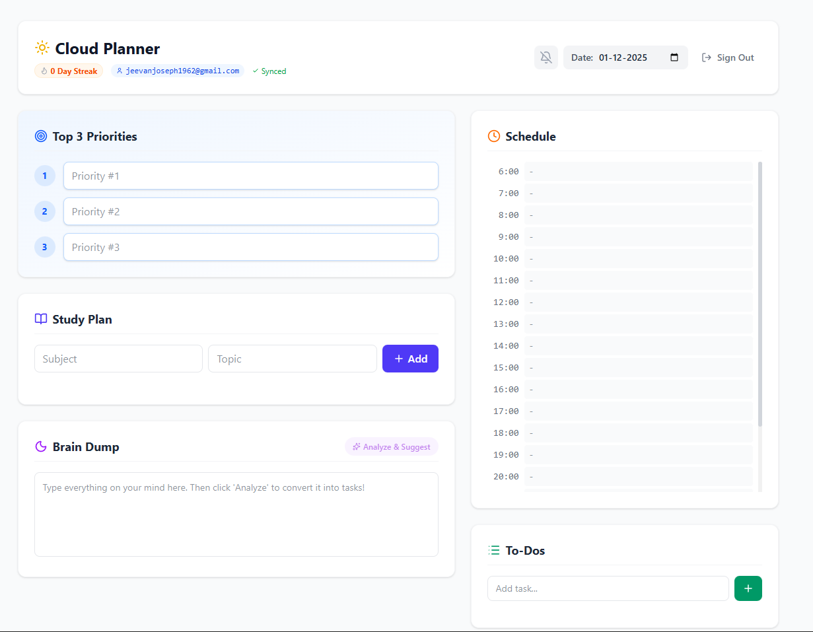

<h1>🚀 Cloud Productivity Planner</h1>

<strong>A smart, AI-powered daily planner built for synchronization and focus.</strong>

<h3>
<a href="https://productivity-planner-2371e.web.app/">View Live Demo</a>
 | 
<a href="https://github.com/jeevanjoseph03/productivity-planner">Report Bug</a>
</h3>

 

🖼️ Interface

  <!-- Replace 'screenshot.png' with the actual filename inside src/assets/ -->
  

📝 About The Project

This project is a full-stack Progressive Web App (PWA) designed to solve the problem of fragmented planning. Unlike standard to-do lists, this planner enforces the "Eat the Frog" methodology and uses AI to declutter your mind.

Key Features:

☁️ Real-Time Cloud Sync: Built on Firebase Firestore; start planning on your laptop and check off items on your phone instantly.

🧠 AI Assistant: Integrated with Google Gemini API. Type messy thoughts into the "Brain Dump" section, and the AI automatically structures them into actionable tasks.

🔥 Streak System: A gamified streak counter to encourage daily consistency.

🎯 "Eat the Frog" Focus: Dedicated section for the top 3 absolute priorities of the day.

📅 Time Blocking: Full-day scheduler (6:00 AM – 12:00 AM) to visualize your day.

📱 Mobile Optimized: Fully responsive design that works like a native app.

🛠️ Technical Depth

This project was built to demonstrate proficiency in modern React patterns and Serverless architecture.

Frontend: React (Vite), Tailwind CSS for styling, Lucide React for iconography.

Backend as a Service: Firebase Auth (Email/Pass), Firebase Firestore (NoSQL Database).

AI Integration: Direct REST API calls to Google Gemini 2.5 Flash model.

State Management: React Hooks (useState, useEffect) + Real-time Firestore listeners (onSnapshot).

🚀 Getting Started

To get a local copy up and running, follow these steps.

Prerequisites

Node.js (v18 or higher)

A Firebase Project

Google AI Studio API Key

Installation

Clone the repository

git clone [https://github.com/your_username/productivity-planner.git](https://github.com/your_username/productivity-planner.git)
cd productivity-planner

Install dependencies

npm install

Configure Environment Variables
Create a .env file in the root directory and add your keys:

VITE_API_KEY=your_firebase_api_key
VITE_AUTH_DOMAIN=your_project.firebaseapp.com
VITE_PROJECT_ID=your_project_id
VITE_STORAGE_BUCKET=your_bucket.appspot.com
VITE_MESSAGING_SENDER_ID=your_sender_id
VITE_APP_ID=your_app_id
VITE_GEMINI_API_KEY=your_gemini_api_key

Run the application

npm run dev

📂 Project Structure

productivity-planner/
├── src/
│   ├── assets/         # Images and icons
│   ├── App.jsx         # Main application logic
│   ├── firebase.js     # Firebase configuration
│   ├── index.css       # Tailwind imports
│   └── main.jsx        # Entry point
├── .env                # API Keys (Not uploaded to Git)
├── tailwind.config.js  # Tailwind configuration
└── README.md

🔮 Future Improvements

[ ] Google Calendar Integration: Sync time blocks with G-Cal.

[ ] Push Notifications: Use Firebase Cloud Messaging for offline alerts.

[ ] Dark Mode: System-wide dark mode toggle.

[ ] Weekly Analytics: A dashboard showing study hours vs. task completion rates.

🤝 Contact

[[JEEVAN GEORGE](https://www.linkedin.com/in/jeevanjoseph03/)]

Project Link: https://github.com/jeevanjoseph03/productivity-planner